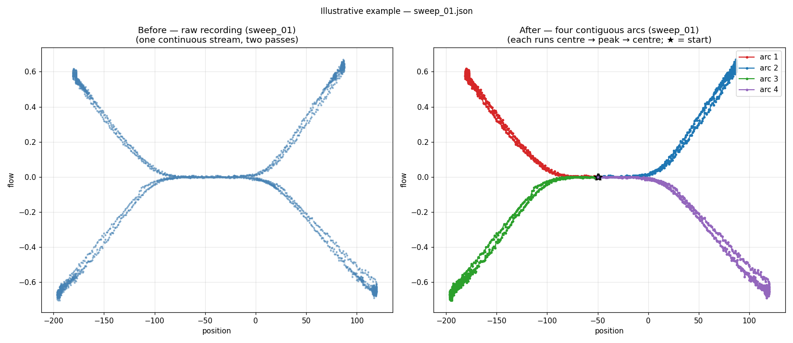

# Technical task: splitting a valve recording into arcs

Thanks for taking the time to do this. We are more interested in how you reason
about messy real data than in a perfect answer, so please don't over-invest —
something that works and that you can explain is exactly what we are after.

## What we provide

- `data/` — six recordings (`sweep_01.json` … `sweep_06.json`). A good solution
  should cope with the awkward ones, not only the tidy ones.
- `sweep_tools.py` — `load_recording(path)` returns aligned
  `(position, flow, timestamp)` lists, and `plot_arcs(...)` will draw a recording
  and colour a set of arcs you pass in. Use, change or ignore these as you like.
  (`load_recording` needs only the standard library; `plot_arcs` requires `matplotlib`.)

## Example

The image below shows what a correct result looks like, using `sweep_01.json`.
Left: the raw recording as given. Right: the same data split into four
contiguous arcs, each running centre → peak → centre. The ★ marks the start
of each arc.

